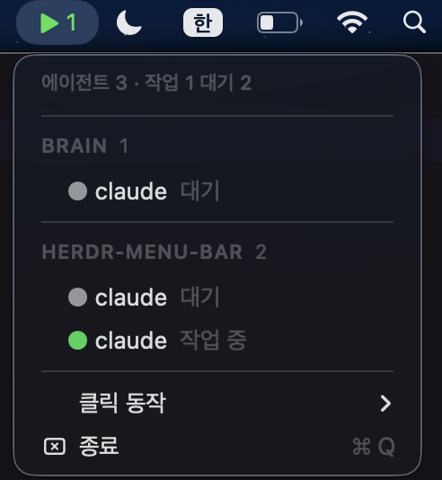

# herdr menubar

[herdr](https://herdr.dev)에서 실행한 AI 에이전트의 상태를 메뉴바에서 한눈에 확인할 수 있는 앱입니다.



> 🇺🇸 [English README](README.md)

## 다운로드

[Releases](../../releases)에서 최신 `.dmg`나 `.zip`을 받아서, `herdr-menu-bar.app`을 `/Applications`로 옮겨 주세요.

처음 한 번은 **우클릭 → 열기**로 실행해 주세요. ad-hoc 서명이라 공증이 없어서 macOS가 한 번 경고합니다. 그다음부터는 더블클릭으로 바로 열립니다.

**필요한 것:** macOS 13 이상, [herdr](https://herdr.dev) 설치(기본 경로는 `/opt/homebrew/bin/herdr`, `HERDR_BIN` 환경변수로 바꿀 수 있습니다). 소켓은 자동으로 찾습니다.

## 주요 기능

- **메뉴바 아이콘** — 우선순위가 가장 높은 상태를 바로 보여줍니다: ⚠ blocked, ▶ working, ✓ done, ○ idle.
- **드롭다운** — workspace별로 묶은 에이전트 목록을 보여줍니다. 각 줄에 상태 점, 종류(claude/codex), 상태를 함께 표시합니다.
- **적응형 폴링** — 메뉴가 열려 있을 때는 1초마다, 닫혀 있을 때는 10초마다 갱신합니다.
- **자동 복구** — herdr가 실행 중이 아니면 `—`로 표시하고, 다시 실행되면 자동으로 상태 표시를 되살립니다. herdr 연결이 끊겨도 앱이 멈추지 않습니다.
- **클릭 → pane 이동** — 기본은 꺼져 있습니다. 켜면 에이전트를 클릭했을 때 해당 터미널 pane으로 포커스를 옮깁니다.

## 빌드

[Swift 6.1+](https://www.swift.org/install/macos/)가 필요합니다.

```bash
swift build              # 또는: swift build -c release
swift run                # 바로 실행
swift test               # 테스트
scripts/build-app.sh     # dist/herdr-menu-bar.app 생성
```

## 설정

클릭 동작은 드롭다운의 **클릭 동작** 서브메뉴에서 고를 수 있습니다(`이동 안 함` / `kaku로 이동`). 설정은 `UserDefaults`에 저장됩니다.

## 구조

```
Sources/HerdrCore/      플랫폼 중립 로직 (CLI, 디코딩, 집계)
Sources/HerdrMenuBar/   AppKit UI (NSStatusItem, 메뉴, 설정)
Tests/HerdrCoreTests/   단위 테스트 + 픽스처
```

## 릴리스 만들기 (메인테이너용)

```bash
scripts/package-release.sh   # .zip
scripts/package-dmg.sh       # .dmg
```

`dist/`에 만들어진 파일을 새 [GitHub Release](../../releases)에 올리면 됩니다. 설명은 [`.github/RELEASE_TEMPLATE.md`](.github/RELEASE_TEMPLATE.md)를 쓰고, `Resources/Info.plist`의 `CFBundleShortVersionString`을 올려 주세요.

## 아직 안 되는 것

- `kaku로 이동`은 [kaku](https://github.com/tw93/Kaku) CLI가 `PATH`에 있어야 하고, 제목이 `herdr`인 pane을 찾아 포커스를 옮깁니다. 다른 터미널은 아직 지원하지 않습니다.

## 기여하기

이슈와 PR은 언제든 환영합니다. PR을 열기 전에 `swift test`를 한 번 돌려 주시고, 변경은 꼭 필요한 범위로만 해주세요.
